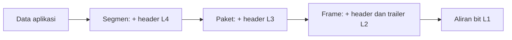

# LAPORAN KONSEP JARINGAN

## BAB 2 — MODEL OSI, TCP/IP, DAN ENKAPSULASI


| Identitas | Keterangan |
|---|---|
| **Nama** | Marsha Rifky Febriansyah |
| **NRP** | 3125600031 |
| **Dosen Pengajar** | Dr. Ferry Astika Saputra, ST. M.Sc |
| **Program Studi** | D4 Teknik Informatika |
| **Institusi** | Politeknik Elektronika Negeri Surabaya (PENS) |
| **Tahun** | 2026 |

---

## Daftar Isi

- [Level A — Ingatan dan Pemahaman (1–10)](#level-a--ingatan-dan-pemahaman)
- [Level B — Penerapan dan Analisis (11–20)](#level-b--penerapan-dan-analisis)
- [Level C — Evaluasi dan Sintesis (21–30)](#level-c--evaluasi-dan-sintesis)
- [Kesimpulan](#kesimpulan)
- [Referensi](#referensi)

---

## Level A — Ingatan dan Pemahaman

**Soal 1–10**

### 1. Jelaskan alasan komunikasi jaringan disusun berlapis.

Komunikasi jaringan merupakan sistem rekayasa yang sangat kompleks karena melibatkan spektrum permasalahan yang luas—mulai dari modulasi sinyal elektromagnetik pada media kabel atau udara, deteksi bit galat, pengalamatan rute global, kontrol aliran, hingga antarmuka perangkat lunak aplikasi tingkat tinggi. Komunikasi jaringan disusun secara berlapis (layered architecture) dengan alasan-alasan fundamental berikut:

- **a.** **Pemisahan Tanggung Jawab (Separation of Concerns & Modularity):** Setiap lapisan hanya fokus menyelesaikan satu kelompok masalah teknis tertentu. Protokol aplikasi seperti HTTP tidak perlu mengetahui apakah data ditransmisikan melalui kabel tembaga UTP, serat optik, atau gelombang radio Wi-Fi.
- **b.** **Abstraksi dan Kemudahan Pemeliharaan (Information Hiding):** Perubahan atau pembaruan implementasi pada satu lapisan (misalnya meningkatkan kartu jaringan dari Fast Ethernet ke Gigabit Ethernet) tidak mengharuskan penulisan ulang pada lapisan di atasnya (IP, TCP, maupun aplikasi web), asalkan antarmuka antarlapisan tetap konsisten.
- **c.** **Interoperabilitas dan Standardisasi Multivendor:** Pembagian lapisan menciptakan standar antarmuka dan protokol terbuka, memungkinkan berbagai vendor perangkat keras dan perangkat lunak di seluruh dunia menciptakan produk yang dapat saling beroperasi (interoperable).
- **d.** **Penyederhanaan Diagnostik dan Pembelajaran:** Saat terjadi kegagalan transmisi, teknisi dapat mengisolasi gangguan secara bertahap dan sistematis (misalnya memeriksa lapisan fisik terlebih dahulu sebelum menyelidiki konfigurasi IP atau DNS).

### 2. Bedakan layanan, antarmuka, dan protokol.

Konsep layanan, antarmuka, dan protokol merupakan tiga komponen utama arsitektur berlapis:

| Komponen | Definisi & Karakteristik | Orientasi Hubungan | Contoh Nyata |
| --- | --- | --- | --- |
| Layanan (Service) | Kumpulan fungsionalitas dan kapabilitas yang disediakan oleh suatu lapisan kepada lapisan tepat di atasnya. Menentukan apa yang dilakukan, bukan cara kerjanya. | Vertikal (ke lapisan atas) | Lapisan Transport menyediakan layanan transfer byte-stream andal (reliable) dan bebas kesalahan. |
| Antarmuka (Interface) | Titik temu atau sarana operasional (API / SAP) yang digunakan lapisan atas untuk memanggil dan mengakses layanan lapisan bawah pada mesin yang sama. | Vertikal (lokal host) | Socket API (fungsi socket(), connect(), send(), recv()) pada sistem operasi. |
| Protokol (Protocol) | Kumpulan aturan, sintaksis, semantik, format pesan, dan mekanisme sinkronisasi pertukaran informasi antara dua entitas setingkat (peer entities) pada mesin berbeda. | Horizontal (antar-mesin) | Protokol TCP (3-way handshake, nomor urut sequence, konfirmasi ACK, sliding window). |

### 3. Sebutkan tujuh lapisan OSI dari bawah ke atas beserta fungsi utamanya.

Model referensi Open Systems Interconnection (OSI) terdiri atas tujuh lapisan dari bawah ke atas:

1. **Lapisan 1 – Physical (Fisik):** Bertanggung jawab atas transmisi aliran bit mentah (raw bit stream) melalui media fisik. Mengatur level tegangan listrik, modulasi sinyal radio/optik, konektor, dan kecepatan bit.
2. **Lapisan 2 – Data Link:** Bertanggung jawab atas pembentukan bingkai (framing), pengalamatan fisik (MAC Address), deteksi galat lokal (FCS/CRC), serta kontrol akses media transmisi bersama.
3. **Lapisan 3 – Network (Jaringan):** Bertanggung jawab atas pengalamatan logis global (IP Address), pemilihan jalur rute terbaik (routing), dan penerusan paket (forwarding) melintasi jaringan heterogen.
4. **Lapisan 4 – Transport:** Bertanggung jawab atas komunikasi ujung-ke-ujung (end-to-end) antar-proses aplikasi, pengalamatan nomor port, segmentasi/reassembly data, serta kendali aliran dan kemacetan.
5. **Lapisan 5 – Session (Sesi):** Bertanggung jawab atas pembentukan, pengelolaan dialog, sinkronisasi (checkpointing), dan penutupan sesi komunikasi antar-aplikasi yang berinteraksi.
6. **Lapisan 6 – Presentation (Presentasi):** Bertanggung jawab atas representasi sintaksis dan semantik data, mencakup translasi format data (misalnya ASCII/Unicode), kompresi, serta enkripsi/dekripsi konseptual.
7. **Lapisan 7 – Application (Aplikasi):** Bertanggung jawab menyediakan antarmuka langsung ke aplikasi pengguna dan protokol jaringan tingkat tinggi (seperti HTTP, DNS, SMTP, SSH, FTP).

### 4. Sebutkan empat lapisan model TCP/IP.

Berdasarkan standar RFC 1122, model arsitektur TCP/IP terdiri dari empat lapisan:

1. **Application Layer:** Menggabungkan fungsi lapisan Aplikasi, Presentasi, dan Sesi dari model OSI. Menyediakan protokol pertukaran informasi tingkat tinggi bagi pengguna (misal: HTTP, DNS, SSH, SMTP).
2. **Transport Layer:** Menyediakan layanan pengiriman data proses-ke-proses antar-host di jaringan (protokol utama: TCP dan UDP).
3. **Internet Layer:** Mengatur pengalamatan logis dan perutean paket independen melintasi jaringan heterogen (protokol utama: IPv4, IPv6, ICMP, ARP).
4. **Link Layer (Network Access):** Mengatur antarmuka fisik dan pembentukan bingkai data pada media transmisi lokal spesifik (misal: Ethernet IEEE 802.3, Wi-Fi IEEE 802.11, PPP).

### 5. Mengapa model TCP/IP kadang disajikan sebagai lima lapisan?

Dalam literatur akademik ilmu komputer (seperti buku karya Andrew S. Tanenbaum serta James F. Kurose & Keith W. Ross), arsitektur disajikan sebagai model 5 lapisan (Hybrid 5-Layer Model) karena alasan berikut:

- **Pemisahan Logika Framing dan Media Fisik:** Pada model 4-lapisan TCP/IP klasik, Link Layer menggabungkan logika framing perangkat lunak dan karakteristik perangkat keras fisik ke dalam satu kotak hitam (black box).
- **Nilai Edukatif dan Diagnostik:** Pemisahan Link Layer menjadi Lapisan Data Link (Lapisan 2) dan Lapisan Fisik (Lapisan 1) sangat krusial agar mahasiswa dapat membedakan secara tegas antara logika manipulasi bit/framing/MAC address dengan fenomena fisis gelombang radio, sinyal listrik tembaga, dan pulsa cahaya serat optik.
- **Keselarasan Praktis:** Tiga lapisan di atasnya tetap mengadopsi model TCP/IP praktis: Network (L3), Transport (L4), dan Application (L5).

### 6. Apa perbedaan frame, IP packet, TCP segment, dan UDP datagram?

Keempat istilah tersebut merupakan Protocol Data Unit (PDU) pada lapisan yang berbeda:

- **Frame:** PDU pada Data Link Layer (L2). Dibungkus oleh header MAC dan diakhiri dengan trailer FCS/CRC untuk menjamin integritas transmisi pada satu link lokal.
- **IP Packet / Datagram:** PDU pada Network Layer (L3). Memuat header IP (alamat IP sumber dan tujuan, TTL, Protocol ID) untuk melintasi router antarjaringan.
- **TCP Segment:** PDU pada Transport Layer (L4) untuk protokol connection-oriented. Memuat nomor urut (Sequence Number), nomor konfirmasi (ACK), window size, dan flags untuk menjamin keandalan pengiriman berurutan.
- **UDP Datagram:** PDU pada Transport Layer (L4) untuk protokol connectionless berbobot ringan. Headernya hanya 8 byte (Port Asal, Port Tujuan, Panjang, Checksum) tanpa fitur pelacakan urutan atau retransmisi.

### 7. Definisikan header, trailer, dan payload.

- **Header:** Blok metadata kontrol yang ditambahkan di bagian awal/depan unit data oleh protokol suatu lapisan (berisi alamat, tipe protokol lanjutan, nomor urut, kontrol bit).
- **Trailer:** Blok informasi kontrol yang ditambahkan di bagian akhir/belakang unit data. Umumnya hanya terdapat pada Data Link layer (berisi kode verifikasi integritas data seperti FCS/CRC-32 Ethernet).
- **Payload:** Muatan data aktual yang dibawa oleh PDU. Payload merupakan Service Data Unit (SDU) murni yang berasal dari lapisan tepat di atasnya.

### 8. Jelaskan enkapsulasi dan dekapsulasi.

- **Enkapsulasi:** Proses pembungkusan data secara bertingkat dari atas ke bawah pada sisi pengirim (transmitting host). Setiap lapisan menambahkan metadata header/trailer miliknya ke payload yang diterima dari lapisan atasnya sebelum diserahkan ke lapisan bawah.



- **Dekapsulasi:** Proses pelepasan pembungkus secara bertahap dari bawah ke atas pada sisi penerima (receiving host). Setiap lapisan memeriksa validitas header, mengekstrak informasi kontrol, membuang header tersebut, lalu meneruskan payload murni ke entitas protokol di lapisan atasnya.

### 9. Apa fungsi multiplexing dan demultiplexing?

- **Multiplexing:** Mekanisme pada pengirim yang memungkinkan berbagai proses aplikasi pada satu host untuk secara simultan berbagi satu media transmisi jaringan bersama (menggunakan pengenal Port Number di L4, Protocol ID di L3, dan EtherType di L2).
- **Demultiplexing:** Mekanisme pada penerima untuk membedah data yang datang dari saluran bersama, membaca pengenal pada header, dan mengarahkan muatan secara akurat ke soket proses aplikasi tujuan yang berhak menerimanya.

### 10. Mengapa OSI tidak boleh dianggap sebagai spesifikasi implementasi?

- **Model Teoretis vs Praktis:** Model OSI dirancang oleh ISO sebagai kerangka referensi konseptual (Conceptual Reference Model) untuk membagi tanggung jawab fungsional secara teoritis, bukan sebagai cetak biru kode implementasi.
- **Kompleksitas Protokol Asli OSI:** Stack protokol implementasi OSI asli (seperti CLNP, TP4, FTAM) sangat rumit, boros overhead komputasi, dan lambat berkembang.
- **Filosofi Running Code TCP/IP:** Keberhasilan Internet didorong oleh filosofi IETF: 'rough consensus and running code', di mana tumpukan TCP/IP dikembangkan secara pragmatis, teruji di lapangan, dan berkinerja tinggi.

---

## Level B — Penerapan dan Analisis

**Soal 11–20**

### 11. Petakan HTTP, TLS, TCP, UDP, QUIC, IPv6, ICMP, Ethernet, Wi-Fi, dan DNS ke model TCP/IP. Tandai protokol yang pemetaannya memerlukan penjelasan.

| Protokol | Lapisan TCP/IP | Penjelasan Khusus Pemetaan |
| --- | --- | --- |
| HTTP | Application | Protokol pertukaran dokumen web murni di lapisan aplikasi. |
| DNS | Application | Layanan resolusi nama domain ke IP; berjalan di lapisan aplikasi (port 53). |
| TLS* | Application / Antara App & Transport | *[Perlu Penjelasan]: TLS berjalan di user space di atas TCP sehingga sering diklasifikasikan ke Application Layer. Namun secara fungsional bertindak sebagai sub-layer keamanan kriptografi (mirip fungsi Presentation/Session OSI). |
| QUIC* | Transport (di atas UDP) / App Hybrid | *[Perlu Penjelasan]: QUIC diimplementasikan di user space di atas UDP (port 443), namun secara fungsional menyediakan layanan Transport Layer penuh (koneksi andal, congestion control, multiplexing) terintegrasi TLS 1.3. |
| TCP | Transport | Protokol transport standar yang andal (connection-oriented). |
| UDP | Transport | Protokol transport berbobot ringan (connectionless, unreliable). |
| IPv6 | Internet | Protokol pengalamatan logis global 128-bit dan routing. |
| ICMP* | Internet | *[Perlu Penjelasan]: Pesan ICMP dienkapsulasi di dalam payload IP (seperti L4), namun secara arsitektur merupakan bagian integral dari Internet Layer untuk pelaporan galat dan kendali diagnostik (ping, traceroute). |
| Ethernet | Link | Standar komunikasi kabel fisik dan data link lokal IEEE 802.3. |
| Wi-Fi | Link | Standar komunikasi nirkabel lokal IEEE 802.11. |

### 12. Gambarkan enkapsulasi permintaan DNS melalui UDP, IPv4, dan Ethernet. Sebutkan pengenal yang digunakan pada setiap batas.

**Susunan frame DNS melalui UDP/IPv4/Ethernet:**

```text
[Ethernet Header: 14 byte]
  [IPv4 Header: 20 byte]
    [UDP Header: 8 byte]
      [DNS Query: domain, Type A]
[Ethernet Trailer: FCS 4 byte]

```

| Batas / Bagian | Pengenal / Informasi |
|---|---|
| Ethernet → IPv4 | `EtherType = 0x0800` |
| IPv4 → UDP | `Protocol ID = 17` |
| UDP → DNS | `Destination Port = 53` |
| DNS Query | Transaction ID dan Query Flags |
| Integritas Ethernet | CRC-32 pada FCS |

Pengenal yang digunakan pada setiap batas lapisan:

1. **Batas Link ke Network (Ethernet -> IPv4):** Field EtherType pada header Ethernet bernilai 0x0800, menginstruksikan modul Data Link untuk menyerahkan payload ke modul IPv4.
2. **Batas Network ke Transport (IPv4 -> UDP):** Field Protocol pada header IPv4 bernilai 17 (0x11), menandakan bahwa payload paket IP harus didekapsulasi oleh modul UDP.
3. **Batas Transport ke Application (UDP -> DNS):** Field Destination Port pada header UDP bernilai 53, merujuk pada soket layanan daemon DNS Resolver.
4. **Batas Transaksi Aplikasi (Klien <-> Server):** Field Transaction ID (TxID) pada header DNS (16-bit) digunakan klien untuk mencocokkan respons DNS yang diterima dengan kueri aslinya.

### 13. HTTP/3 melalui QUIC dan penjelasan mengapa QUIC tetap dianggap transport.

**Susunan paket HTTP/3 melalui QUIC:**

```text
[Ethernet Header: MAC sumber/tujuan, EtherType=0x0800]
  [IPv4 Header: IP tujuan server, Protocol=17]
    [UDP Header: port tujuan 443]
      [QUIC Header: Connection ID, Packet Number]
        [Payload terenkripsi: TLS 1.3 dan frame HTTP/3]
[Ethernet Trailer: FCS (CRC-32)]

```

Mengapa QUIC tetap dapat dianggap sebagai protokol Transport Layer sejati meskipun berjalan di atas UDP?

1. **Keandalan Mandiri (Autonomous Reliability):** QUIC mengelola nomor urut paket, acknowledgement (ACK), dan mekanisme retransmisi mandiri tanpa bergantung pada UDP (yang dasarnya tidak andal).
2. **Kontrol Aliran dan Kemacetan:** QUIC memiliki algoritma pengendalian kemacetan modern (seperti BBR/CUBIC) dan flow control independen baik per-stream maupun per-koneksi.
3. **Pemberantasan Head-of-Line Blocking (HOL):** Stream-stream data pada QUIC bersifat independen; hilangnya paket pada satu stream tidak menghambat pemrosesan stream lainnya.
4. **UDP Hanya sebagai Substrat Penetrasi (Middlebox Traversal):** QUIC menggunakan UDP semata-mata sebagai pembungkus agar paketnya dapat melewati miliaran perangkat perantara internet (middlebox, NAT, firewall) di seluruh dunia yang biasanya memblokir protokol transport baru selain TCP/UDP.

### 14. Dua host berada pada subnet berbeda. Jelaskan header mana yang berubah dan tetap ketika paket melewati satu router (tanpa NAT).

Ketika paket melintasi router tanpa NAT:

- **IP Source & Destination Address (Tetap):** Alamat IP Sumber dan Tujuan tetap sama dari host pengirim hingga host penerima akhir.
- **Header Transport TCP/UDP (Tetap):** Port sumber, port tujuan, sequence number, acknowledgement number, dan checksum L4 tidak disentuh oleh router.
- **Payload Aplikasi (Tetap):** Muatan data aplikasi tidak mengalami perubahan.
- **Data Link Header & Trailer (Berubah):** Seluruh frame lama dibongkar pada interface masuk router. Router membentuk frame baru di interface keluar: Source MAC diganti dengan MAC interface keluar router, dan Destination MAC diganti dengan MAC next-hop router atau host tujuan. Trailer FCS/CRC dihitung ulang.
- **Network Header TTL & Checksum (Berubah):** Nilai TTL berkurang satu (TTL = TTL - 1) untuk mencegah looping paket, dan IPv4 Header Checksum wajib dihitung ulang oleh router karena nilai field TTL berubah.

### 15. Perubahan analisis apabila router tersebut juga melakukan NAT/PAT.

1. **Perubahan pada Network Layer (IP Header):** Alamat Source IP (pada arah outbound) diganti dari IP privat menjadi IP publik milik interface luar router, dan IPv4 Header Checksum dihitung ulang secara total.
2. **Perubahan pada Transport Layer (TCP/UDP Header):** Nilai Source Port diubah menjadi port translasi acak yang dialokasikan router (PAT multiplexing). Checksum TCP/UDP wajib dihitung ulang karena perhitungan checksum L4 melibatkan Pseudo-Header yang memuat IP Sumber dan Port Sumber yang baru saja berubah.
3. **Pemeliharaan State Table Translasi:** Router mencatat pemetaan tuple [IP Privat:Port Asal <--> IP Publik:Port NAT <--> IP Tujuan:Port Tujuan] dalam memori state table agar paket balasan inbound dapat diterjemahkan kembali ke host privat semula.

### 16. Sebuah capture menunjukkan checksum TCP salah pada paket keluar, tetapi komunikasi normal. Ajukan hipotesis yang berkaitan dengan NIC offload.

- **Hipotesis:** TCP Checksum Offloading (Tx Checksum Offload) pada kartu jaringan (NIC).
- **Mekanisme Penyebab:** Sistem operasi modern mengalihkan beban komputasi kalkulasi checksum dari CPU utama ke prosesor khusus (ASIC) yang terdapat pada kartu jaringan fisik (NIC).
- **Alasan Tampilan Salah pada Wireshark:** Wireshark menyadap paket di tingkat driver kernel sistem operasi (Npcap/WinPcap) sebelum paket tersebut diserahkan ke kartu jaringan fisik. Pada buffer kernel tersebut, field TCP Checksum sengaja diisi nilai dummy kosong (0x0000) atau nilai sementara yang salah.
- **Mengapa Komunikasi Berjalan Normal:** Saat paket melewati chip hardware NIC, perangkat keras secara instan menghitung checksum yang valid dan menulisnya ke dalam header sebelum bit dipancarkan ke kabel. Akibatnya, host penerima menerima paket dengan checksum yang 100% sah dan valid.

### 17. Pengguna dapat membuka portal dengan alamat IP, tetapi tidak dengan nama. Gunakan model lapisan untuk menyusun diagnosis.

1. **Evaluasi Lapisan 1 s/d 4 (Fisik hingga Transport):** Normal. Keberhasilan akses via IP membuktikan bahwa media fisik, perutean IP antarsubnet, jabat tangan TCP port 80/443, dan pertukaran HTTP berfungsi normal.
2. **Isolasi Masalah pada Lapisan 5/7 (Aplikasi - DNS):** Masalah terisolasi secara mutlak pada proses Resolusi Nama Domain (DNS). Prosedur diagnosis bertingkat:
   - a. Periksa konfigurasi IP DNS resolver pada klien menggunakan perintah 'ipconfig /all'.
   - b. Uji resolusi langsung menggunakan 'nslookup portal.domain.ac.id' untuk melihat apakah DNS server merespons atau timeout.
   - c. Pastikan port UDP 53 tidak diblokir oleh firewall lokal atau gateway.
   - d. Bersihkan DNS cache lokal ('ipconfig /flushdns') dan periksa berkas hosts (C:\Windows\System32\drivers\etc\hosts) dari pemetaan usang.
   - e. Verifikasi record A / AAAA pada server DNS otoritatif kampus.

### 18. Ping ke server berhasil, tetapi HTTPS gagal. Susun sedikitnya enam hipotesis pada lapisan Transport hingga Application.

Karena 'ping' menggunakan protokol ICMP pada Network Layer (L3), keberhasilan ping hanya membuktikan bahwa jalur routing IP berfungsi. Kegagalan HTTPS (TCP 443) dapat dianalisis melalui enam hipotesis berikut:

1. **Lapisan Transport (L4) – Port 443 Diblokir Firewall:** Firewall di server atau router membolehkan ICMP (ping), namun memblokir paket TCP SYN menuju port 443 (packet dropped/filtered).
2. **Lapisan Transport (L4) – Daemon Web Server Mati:** Layanan web server (Nginx/Apache/IIS) mati/crash, sehingga tidak ada proses yang mendengarkan pada soket port 443 (menghasilkan respon TCP RST).
3. **Lapisan Transport/Network (L4/L3) – Path MTU Black Hole:** Paket ping kecil lolos, namun saat jabat tangan TLS mentransmisikan sertifikat digital besar (>1500 byte), paket ditandai Don't Fragment (DF) dan di-drop oleh router perantara tanpa notifikasi ICMP.
4. **Lapisan Sesi/Presentasi (L5/L6) – TLS Handshake Failure:** Klien dan server tidak memiliki kesepakatan versi TLS atau cipher suite kriptografi yang kompatibel (misal klien hanya mendukung TLS 1.1 lama sementara server mewajibkan TLS 1.3).
5. **Lapisan Aplikasi (L7) – Kegagalan Validasi Sertifikat SSL/TLS:** Sertifikat digital server kedaluwarsa, self-signed tanpa Root CA tepercaya di klien, atau nama domain yang diakses tidak cocok dengan nama pada sertifikat (CN/SAN mismatch).
6. **Lapisan Aplikasi (L7) – Masalah Reverse Proxy / Backend:** Koneksi TLS berhasil terbentuk ke reverse proxy, namun server backend aplikasi di belakangnya mati atau timeout (menghasilkan HTTP 502/503/504).

### 19. Bandingkan sesi aplikasi dengan koneksi TCP. Berikan contoh ketika sesi bertahan setelah koneksi berubah.

- **Koneksi TCP:** Konstruk Transport Layer yang merepresentasikan pipa data logis antara dua soket ujung-ke-ujung. Terikat kaku pada 4-tuple: (IP Asal, Port Asal, IP Tujuan, Port Tujuan). Jika IP berubah, koneksi langsung terputus.
- **Sesi Aplikasi:** Konstruk Application Layer yang merepresentasikan konteks interaksi logis pengguna dengan aplikasi (status login, transaksi belanja). Terikat pada Session Token, Cookie, atau JWT.
- **Contoh Skenario Nyata:** Pengguna sedang mendengarkan musik di Spotify atau mengakses Mobile Banking melalui Wi-Fi rumah, lalu berjalan keluar rumah dan ponsel beralih ke jaringan data seluler 4G/5G:
  - Koneksi TCP lama seketika mati dan terputus karena IP ponsel berubah dari IP Wi-Fi ke IP seluler.
  - Sesi aplikasi TETAP BERTAHAN secara utuh. Aplikasi ponsel secara otomatis membuat koneksi TCP baru dengan menyertakan token otentikasi JWT yang valid, sehingga pengguna dapat terus mendengarkan musik tanpa harus login ulang.

### 20. Jelaskan mengapa enkripsi tidak dapat selalu ditempatkan secara mutlak pada Presentation layer.

Penempatan enkripsi secara mutlak pada satu lapisan tunggal tidak realistis karena model ancaman (threat models) dan batas kepercayaan (trust boundaries) di dunia nyata sangat bervariasi:

1. **MACsec (Layer 2 - Data Link):** Diperlukan untuk enkripsi fisik hop-by-hop antar-switch guna melindungi kabel serat optik antar-gedung dari penyadapan fisik tanpa membebani host akhir.
2. **IPsec (Layer 3 - Network):** Diperlukan untuk site-to-site VPN antar-kantor cabang, mengamankan seluruh lalu lintas paket IP secara transparan tanpa modifikasi software aplikasi.
3. **TLS (Antara Layer 4 & Layer 7):** Mengamankan aliran data aplikasi antara browser dan web server, namun terhenti di titik terminasi reverse proxy atau load balancer.
4. **End-to-End Encryption Aplikasi (Layer 7):** Diperlukan pada aplikasi perpesanan instan (Signal, WhatsApp) di mana pengguna menerapkan Zero-Trust terhadap penyedia jaringan maupun server perantara; enkripsi wajib dilakukan di dalam kode aplikasi sebelum menyentuh soket jaringan.

---

## Level C — Evaluasi dan Sintesis

**Soal 21–30**

### 21. Evaluasi pernyataan: “Model OSI tidak lagi relevan karena Internet menggunakan TCP/IP.”

Pernyataan tersebut keliru dan reduksionis secara akademis:

1. **Model Referensi vs Protokol Implementasi:** Model OSI adalah taksonomi konseptual abstrak yang mendefinisikan batas fungsional komunikasi data yang ideal. TCP/IP adalah tumpukan protokol rekayasa praktis yang terbukti efisien di dunia nyata. Kegagalan produk komersial OSI di pasar tidak membatalkan keabsahan model konseptualnya sebagai alat analisis.
2. **Kosakata Standar Industri:** Industri jaringan global hingga saat ini menggunakan terminologi OSI sebagai standar komunikasi rekayasa (misal membedakan L2 Switch, L3 Router, L4 Firewall, L7 WAF, serta prosedur troubleshooting bertingkat).
3. **Kegunaan Pedagogis:** Model OSI membedah fungsi pemrosesan data (seperti dialog Session dan translasi sintaksis Presentation) secara terperinci, memberikan model mental yang kokoh bagi mahasiswa sebelum melihat bagaimana TCP/IP menggabungkan fungsi-fungsi tersebut secara pragmatis ke lapisan aplikasi.

### 22. Analisis keuntungan dan kerugian strict layering serta batasan cross-layer information.

- **Keuntungan Strict Layering:** Dekopling sempurna, kemudahan pengujian unit per lapisan, dan kebebasan memperbarui implementasi satu lapisan tanpa merusak lapisan lainnya.
- **Kerugian Strict Layering:** Information hiding penalty (lapisan atas tidak mengetahui kondisi riil media fisik sehingga kurang adaptif), serta redundansi fungsi pengecekan error.
- **Kapan Cross-Layer Membantu:** Pada jaringan nirkabel/mobile, aplikasi streaming video (L7) dapat membaca indikator sinyal radio RSSI/SNR (L1/L2) untuk secara proaktif menurunkan resolusi video sebelum terjadi buffer underrun. ECN (Explicit Congestion Notification) pada IP (L3) juga membantu TCP (L4) menurunkan laju kirim tanpa menunggu packet drop.
- **Kapan Merusak Modularitas:** Ketika aplikasi menjadi terikat kaku (tightly coupled) pada atribut perangkat keras tertentu, menghilangkan portabilitas perangkat lunak dan menciptakan spaghetti dependency yang rapuh.

### 23. Prosedur penelusuran gangguan video konferensi tersendat di Wi-Fi kampus saat jam sibuk.

| Lapisan | Alat & Titik Pengujian | Bukti (Evidence) yang Dicari | Analisis Korelasi Gangguan |
| --- | --- | --- | --- |
| Lapisan 1 (Physical) | Spectrum Analyzer / Wi-Fi Analyzer | RSSI normal (-65 dBm), namun Channel Utilization pada band 2.4 GHz mencapai &gt; 85% dan SNR anjlok. | Spektrum RF padat akibat interferensi ko-kanal (co-channel interference) dari puluhan perangkat mahasiswa pada jam sibuk. |
| Lapisan 2 (Data Link) | Wireshark (Monitor Mode 802.11) | Tingkat Frame Retry Rate melonjak &gt; 35%, banyak terjadi tabrakan frame. | Tabrakan di udara (airtime contention) memaksa kartu Wi-Fi melakukan retransmisi berulang kali, memicu lonjakan latensi lokal. |
| Lapisan 3 (Network) | Pengujian ping dan mtr ke default gateway | RTT melonjak fluktuatif dari 5 ms ke &gt; 300 ms (jitter parah) dan packet loss 8%. | Antrean buffer pada Access Point mengalami bufferbloat akibat antrean paket yang menunggu giliran transmisi di media nirkabel. |
| Lapisan 4/7 (Transport & App) | WebRTC Internals / Zoom Statistics | UDP packet loss WebRTC &gt; 12%, codec video otomatis mendowngrade resolusi ke 240p dan frame rate ke 10 fps. | Jitter dan packet loss melampaui toleransi jitter buffer aplikasi, menyebabkan video tersendat dan audio robotik. |

**Kesimpulan & Solusi:** Rekomendasi Solusi: Mematikan band 2.4 GHz untuk area auditorium/kelas padat dan memigrasikan seluruh klien ke band 5 GHz / 6 GHz (Wi-Fi 6 OFDMA), serta mengaktifkan QoS (WMM Voice/Video Priority).

### 24. Rancangan skenario laboratorium perekaman paket yang aman tanpa data sensitif.

1. **Topologi Lingkungan:** Dua mesin virtual terisolasi dalam jaringan Host-Only (Klien: 192.168.56.10, Server: 192.168.56.20) tanpa akses ke jaringan publik kampus.
2. **Konfigurasi Layanan:** Server menjalankan Nginx dengan self-signed TLS certificate demo, menyajikan file statis dummy JSON: {"status": "ok", "demo": true}.
3. **Prosedur Eksekusi:** Klien mengeksekusi 'curl --cacert cert.pem https://192.168.56.20/data.json' sementara Wireshark merekam antarmuka virtual dengan filter capture: host 192.168.56.20.
4. **Hasil Verifikasi Protokol:** Terlihat Ethernet II (MAC & EtherType 0x0800), IPv4 (Alamat IP & Protocol ID 6), TCP (3-way handshake SYN/ACK), TLS (ClientHello, ServerHello, Certificate Exchange), dan muatan HTTP yang terenkripsi aman sebagai Application Data.

### 25. Urutan header VXLAN over IPsec Tunnel dan risiko MTU.

**Urutan enkapsulasi VXLAN over IPsec Tunnel (dari luar ke dalam):**

```text
Outer Ethernet Header (14 byte)
Outer Underlay IPv4 Header (20 byte)
IPsec ESP Header (SPI & Sequence Number, 8 byte)
┌────────────────── AREA TERENKRIPSI IPsec ──────────────────┐
│ Inner Underlay IPv4 Header (20 byte)                      │
│ UDP Header (destination port 4789, 8 byte)                │
│ VXLAN Header (VNI 24-bit, 8 byte)                         │
│ Inner Tenant Ethernet Header (14 byte)                   │
│ Tenant IPv4 Header (20 byte)                              │
│ Tenant TCP Header (20 byte)                               │
│ Tenant Data Payload                                      │
│ IPsec ESP Trailer (~2–18 byte) dan ICV (16 byte)          │
└───────────────────────────────────────────────────────────┘
Outer Ethernet FCS Trailer (4 byte)

```

Analisis Risiko MTU (Maximum Transmission Unit):

- **Akumulasi Overhead:** Enkapsulasi bertingkat ini menambahkan overhead kumulatif sebesar 110 hingga 120+ byte. Jika MTU fisik jaringan underlay tetap 1500 byte, paket tenant 1500 byte akan membengkak menjadi ~1620 byte.
- **Dampak Risiko:** Memicu fragmentasi paket yang membebani CPU router, atau paket langsung di-drop jika bit Don't Fragment (DF) aktif (Path MTU Black Hole).
- **Mitigasi:** Mengaktifkan Jumbo Frames (MTU 9000 atau minimal 1650 byte) pada switch/router fisik underlay, serta menerapkan TCP MSS Clamping (~1360 byte) pada router gateway.

### 26. Bandingkan MACsec, IPsec, TLS, dan enkripsi end-to-end aplikasi.

| Parameter | MACsec (802.1AE) | IPsec (RFC 4301) | TLS (RFC 8446) | E2E Aplikasi (Signal/PGP) |
| --- | --- | --- | --- | --- |
| Lapisan Operasi | Lapisan 2 (Data Link) | Lapisan 3 (Network) | Antara L4 dan L7 | Lapisan 7 (Application) |
| Titik Terminasi | Switch-ke-Switch lokal (Hop-by-Hop). | Gateway-ke-Gateway (VPN) atau Host-ke-Gateway. | Host Klien ke Server Web / Reverse Proxy. | Perangkat Pengirim ke Penerima Akhir. |
| Cakupan Kepercayaan | Sangat sempit (hanya 1 link fisik lokal). | Luas tingkat jaringan (seluruh subnet VPN dipercaya). | Menengah (proses server web dipercaya). | Maksimal (Zero-Trust ke jaringan dan server perantara). |
| Yang Dilindungi | Seluruh frame Ethernet (termasuk paket IP). | Seluruh paket IP (dalam tunnel mode). | Aliran data aplikasi (data stream). | Konten pesan / file murni. |
| Visibilitas Middlebox | Didekripsi di tiap switch hop berikutnya. | Router transit hanya melihat outer IP. | Reverse proxy/WAF dapat membaca data jika memegang kunci TLS. | Server perantara sama sekali tidak dapat membaca plaintext data. |

### 27. Bagaimana firewall, proxy, dan load balancer menantang anggapan bahwa setiap perangkat hanya membaca header lapisannya.

1. **Stateful & Next-Generation Firewall (NGFW):** Stateful firewall membedah header L4 untuk memantau status TCP connection tracking, sementara NGFW melakukan Deep Packet Inspection (DPI) hingga Layer 7 untuk mendeteksi malware dan mengklasifikasikan aplikasi.
2. **Reverse Proxy (Nginx, Envoy):** Menterminasi koneksi TCP dan TLS secara penuh, membaca header HTTP, cookie sesi, dan URI path (L7), lalu membuka koneksi jaringan independen yang baru ke server backend.
3. **Layer-7 Load Balancer:** Mengambil keputusan perutean trafik berdasarkan semantik data aplikasi (misal mengarahkan path /api/checkout ke server pembayaran dan /static/images ke server CDN).

### 28. Gunakan prinsip end-to-end untuk mengevaluasi penempatan fungsi pemeriksaan integritas berkas.

- **Pemeriksaan pada Router (L2/L3):** Tidak Cukup. FCS Ethernet hanya menjamin transmisi pada satu kabel lokal; jika terjadi kerusakan data di memori router atau bus sistem, FCS frame baru yang dibuat router tidak akan mendeteksi kerusakan tersebut.
- **Pemeriksaan pada Transport (L4 - TCP Checksum):** Membantu, Namun Belum Tuntas. Checksum TCP hanya menggunakan aritmatika 16-bit sederhana yang rentan terhadap error collision, dan hanya memvalidasi data saat transit di jaringan (tidak memeriksa saat berkas ditulis ke harddisk).
- **Pemeriksaan pada Aplikasi (L7 - Hash SHA-256 / Digital Signature):** Solusi Mutlak. Hanya aplikasi penerima akhir yang memiliki konteks penuh atas keutuhan berkas dari media penyimpanan asal ke media penyimpanan tujuan (storage-to-storage). Pengecekan di layer bawah hanyalah optimasi performa transit.

### 29. Analisis potensi retry storm ketika aplikasi, service mesh, dan client sama-sama melakukan pengulangan.

- **Mekanisme Amplifikasi Multiplikatif:** Jika Klien mencoba 3 kali, Service Mesh mencoba 3 kali per request, dan Aplikasi backend mencoba 3 kali: satu kegagalan awal menghasilkan 3 x 3 x 3 = 27 permintaan yang membanjiri downstream database yang sedang lambat, memicu pemadaman sistem total (cascading failure).
- **Bersifat Lintas Lapisan:** Retransmisi terjadi secara buta tanpa koordinasi status di Lapisan 4 (TCP retransmission), Lapisan 5/7 (Service Mesh HTTP retry), dan Lapisan 7 (Aplikasi/UI button retry).
- **Strategi Mitigasi:** Penerapan Retry Budgets (maksimal 10-20% trafik), Exponential Backoff dengan Full Jitter, Shared Deadline Propagation (gRPC context deadline), dan implementasi Circuit Breaker.

### 30. Susun argumen apakah materi jaringan pemula sebaiknya memakai model OSI 7 lapisan, TCP/IP 4 lapisan, atau model 5 lapisan.

**Rekomendasi:** Pilihan Posisi Akademik: Model Lima Lapisan (The Hybrid 5-Layer Model)

1. **Tujuan Pembelajaran:** Membekali mahasiswa pemula dengan pemahaman arsitektur jaringan yang seimbang antara ketelitian konsep fisik perangkat keras dengan realitas tumpukan protokol Internet aktual.
2. **Manfaat:** Memisahkan Data Link (logika framing, MAC, switching) dan Fisik (sinyal listrik/optik, kabel, frekuensi radio) yang sebelumnya disatukan secara membingungkan pada model 4-lapisan TCP/IP. Menghilangkan kerancuan lapisan Sesi dan Presentasi OSI yang dalam praktik modern sudah menyatu di dalam library aplikasi. Memiliki keselarasan 1-ke-1 dengan Wireshark.
3. **Keterbatasan:** Mahasiswa tetap perlu diberikan catatan ringkas mengenai istilah historis Layer 5-6 OSI karena sertifikasi vendor (seperti Cisco CCNA) masih kerap merujuk pada konsep tersebut.

---

## Kesimpulan

Arsitektur komunikasi jaringan berlapis memberikan abstraksi modular yang memungkinkan interoperabilitas global multivendor, sementara pemahaman mendalam mengenai batas-batas lapisan, mekanisme enkapsulasi/dekapsulasi, serta dinamika interaksi protokol di dunia nyata—termasuk anomali lintas lapisan—adalah kompetensi inti yang esensial bagi seorang profesional teknologi informasi dan rekayasa perangkat lunak.

---

## Referensi

1. Tanenbaum, A. S., Feamster, N., & Wetherall, D. J. (2021). Computer Networks (6th ed.). Pearson.

2. Kurose, J. F., & Ross, K. W. (2021). Computer Networking: A Top-Down Approach (8th ed.). Pearson.

3. Saltzer, J. H., Reed, D. P., & Clark, D. D. (1984). End-to-End Arguments in System Design. ACM Transactions on Computer Systems, 2(4), 277-288.

4. Internet Engineering Task Force (IETF): RFC 1122 (Host Requirements), RFC 9000 (QUIC), RFC 9114 (HTTP/3), RFC 8446 (TLS 1.3), RFC 7348 (VXLAN).

Tautan RFC: [1122](https://www.rfc-editor.org/rfc/rfc1122) · [9000](https://www.rfc-editor.org/rfc/rfc9000) · [9114](https://www.rfc-editor.org/rfc/rfc9114) · [8446](https://www.rfc-editor.org/rfc/rfc8446) · [7348](https://www.rfc-editor.org/rfc/rfc7348).
